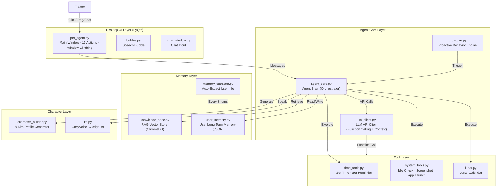
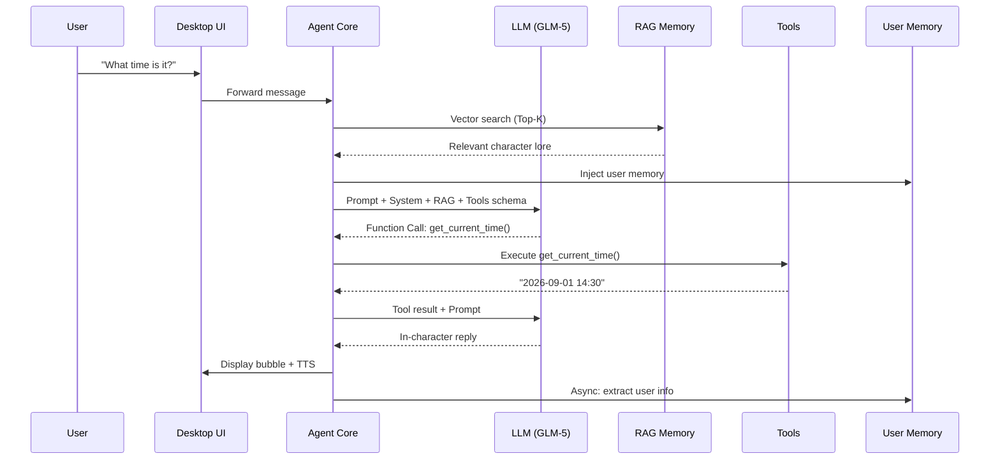
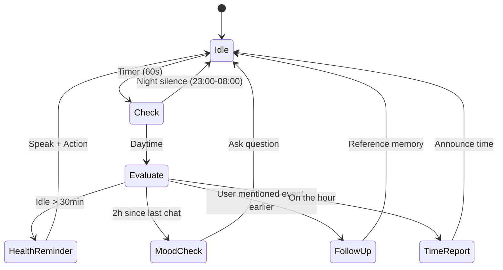

# 🐱 Desktop AI Companion Agent

**A desktop AI pet that actually *lives* with you — proactive, memory-aware, and powered by a full Agent stack.**

> Built with Python + PyQt5 + LLM (Function Calling) + RAG + TTS. Not just a widget — a real Agent system with long-term memory, tool use, and proactive behavior.


---

## 🎯 Why This Project

Most "AI desktop pets" are either pre-scripted widgets or simple chatbots wrapped in a sprite. This project is a **full Agent implementation** that demonstrates every layer of a production AI agent:

| Layer | Implementation |
|-------|---------------|
| **Perception** | User input + system state (idle time, active window, time of day) |
| **Memory** | RAG vector store (character lore) + JSON user memory (auto-extracted) + 10-turn context |
| **Planning** | Function Calling decision engine + proactive behavior state machine |
| **Action** | 5+ tools (time, reminders, screenshot, app launch) + 13 animated actions + TTS voice |
| **Feedback** | User memory extraction every 3 turns + knowledge base hot-reload |

---

## ✨ Features

### 🧠 Full Agent Architecture
- **RAG Long-Term Memory** — Vector knowledge base (ChromaDB) stores character background lore; auto-retrieves relevant context during conversation
- **Function Calling** — Agent autonomously calls tools: get time, set reminders, check idle time, take screenshots, open apps
- **User Memory** — Automatically extracts and persists user info (name, preferences, events, emotions) from conversations; references them naturally
- **Character Builder** — Input any character name + source → LLM generates 8-dimension structured profile → auto-renders System Prompt
- **Proactive Behavior** — Not just reactive. Agent initiates conversations: time reports, health reminders (water/idle/rest/eyes), mood check-ins, follow-up questions based on memory

### 🎭 Character System
- **13 animated actions** with character-specific voice lines
- **Window climbing** — Drag pet to any window edge → sits on top / hangs on side. Window closes → pet falls
- **Irregular mask** — Window shape follows character silhouette (transparent background, always-on-top)
- **Custom persona** — Right-click → Character Settings to edit System Prompt, API config, or generate new characters from scratch

### 💬 Immersive Chat
- Double-click pet → chat input appears
- LLM responds in-character with cold, reticent personality (default: Zhang Qiling from *The Lost Tomb*)
- Context memory (last 10 turns) + RAG background knowledge + user memory injection
- Pink rounded speech bubbles, auto-positioned to not cover pet's face

### 🔊 TTS Voice
- Priority: Alibaba Cloud CosyVoice (deep male voice, character-matched)
- Fallback: edge-tts (YunjianNeural, low-pitched)
- Async generation, non-blocking playback

---

## 🏗️ Architecture

### System Overview



### Agent Decision Pipeline



### Proactive Behavior Flow



---

## 📦 Project Structure

```
pet/
├── pet_agent.py              # Main app: window, interactions, state machine
├── agent_core.py             # Agent brain: RAG + Tools + Memory + Character
├── llm_client.py             # LLM API client (Function Calling + context)
├── proactive.py              # Proactive behavior engine
├── bubble.py                 # Speech bubble UI
├── chat_window.py            # Chat input UI
├── chat_box.py               # Legacy chat component
├── character.py              # Default character config
├── character_settings.py     # Character settings UI (persona + API config)
├── config.py                 # Global config (size, speed, timers)
├── window_manager.py         # Win32 window enumeration + climb detection
├── tts.py                    # TTS engine (CosyVoice → edge-tts fallback)
├── llm/
│   └── character_builder.py  # LLM 8-dimension character profile generator
├── memory/
│   ├── knowledge_base.py     # RAG: document loading, chunking, retrieval
│   ├── vector_store.py       # ChromaDB vector store wrapper
│   ├── embedding_client.py   # Embedding API client
│   ├── user_memory.py        # User long-term memory (JSON persistence)
│   └── memory_extractor.py   # Auto-extract user info from conversations
├── tools/
│   ├── base.py               # BaseTool abstract class
│   ├── registry.py           # Tool registry + OpenAI schema export
│   ├── time_tools.py         # get_current_time, set_reminder
│   ├── system_tools.py       # check_idle_time, take_screenshot, open_application
│   └── lunar.py              # Lunar calendar utilities
├── data/
│   ├── knowledge/            # Character knowledge .txt files (RAG source)
│   └── vector_db/            # ChromaDB persistent storage
├── assets/                   # 17 transparent PNG action sprites
└── api_config.json           # (Optional) API configuration
```

---

## 🚀 Quick Start

### Prerequisites

- Python 3.9+
- Windows 10/11 (uses Win32 API for window climbing)
- An OpenAI-compatible LLM API key (tested with Alibaba Cloud GLM-5)
- (Optional) Alibaba Cloud CosyVoice API key for premium TTS

### Option 1: Run from Source (Recommended)

```bash
# 1. Clone the repository
git clone https://github.com/lgg1234567890/desktop-agent-companion.git
cd desktop-agent-companion

# 2. Create virtual environment
python -m venv .venv
.venv\Scripts\activate  # Windows
# source .venv/bin/activate  # Linux/Mac

# 3. Install dependencies
pip install -r requirements.txt

# 4. Configure API
cp .env.example api_config.json
# Edit api_config.json with your API key:
# {
#   "api_key": "sk-your-key",
#   "api_url": "https://dashscope.aliyuncs.com/compatible-mode/v1/chat/completions",
#   "model": "glm-5"
# }

# 5. Run
python pet_agent.py
```

The pet appears in the bottom-right corner of your screen.

### Option 2: Standalone EXE

Download the latest release from the [Releases](https://github.com/lgg1234567890/desktop-agent-companion/releases) page.

1. Extract `XiaogePet.zip`
2. Double-click `XiaogePet.exe`
3. Right-click pet → Settings → Enter your API key
4. Restart the app

### Controls

| Action | Effect |
|--------|--------|
| **Click** pet | Cycle through 13 actions (idle, walk, sit, jump, etc.) |
| **Double-click** pet | Open chat input dialog |
| **Drag** pet | Move around; drag to window edge → climb/sit on border |
| **Scroll** | Resize pet (larger/smaller) |
| **Right-click** pet | Context menu: select action / walk here / character settings / quit |

### Configuration

All settings are in `api_config.json` (created on first run):

```json
{
  "api_key": "sk-xxx",
  "api_url": "https://dashscope.aliyuncs.com/compatible-mode/v1/chat/completions",
  "model": "glm-5",
  "tts_enabled": true,
  "proactive_enabled": true,
  "proactive_interval": 60
}
```

### Troubleshooting

| Problem | Solution |
|---------|----------|
| Pet doesn't appear | Check Windows Defender didn't quarantine; run as Administrator |
| No voice | Ensure `tts_enabled: true`; CosyVoice key optional, edge-tts is fallback |
| API errors | Verify `api_key` and `api_url` in `api_config.json`; test with `python test_api.py` |
| RAG not working | Delete `data/vector_db/` to rebuild index; ensure embedding API is configured |
| High CPU usage | Disable proactive behavior in settings; increase interval to 300s |

---

## 🔧 Adding Your Own Character

1. Right-click pet → **Character Settings**
2. Enter character name + source (e.g., "Sherlock Holmes, BBC Sherlock")
3. Click **Generate** — LLM creates 8-dimension profile automatically
4. Edit System Prompt if needed, then **Save**
5. Add character knowledge as `.txt` files in `data/knowledge/` for RAG
6. Restart — pet now speaks as your character with lore-accurate knowledge

### Adding Custom Tools

```python
from tools.base import BaseTool

class MyCustomTool(BaseTool):
    @property
    def name(self):
        return "my_custom_tool"
    
    @property
    def description(self):
        return "Use this when the user asks about X"
    
    @property
    def parameters(self):
        return {
            "type": "object",
            "properties": {
                "query": {"type": "string", "description": "What to look up"}
            },
            "required": ["query"]
        }
    
    def execute(self, **kwargs):
        result = do_something(kwargs["query"])
        return result
```

Register in `tools/registry.py`:
```python
self.register(MyCustomTool())
```

The Agent will automatically include it in Function Calling schemas and call it when appropriate.

---

## 🛠️ Tech Stack

| Component | Technology |
|-----------|-----------|
| GUI Framework | PyQt5 |
| Window Management | pywin32 (Win32 API) |
| LLM Backend | OpenAI-compatible API (tested with Alibaba Cloud GLM-5) |
| Function Calling | OpenAI Function Calling schema |
| RAG / Vector DB | ChromaDB + custom embedding client |
| TTS | Alibaba Cloud CosyVoice → edge-tts fallback |
| Image Processing | Pillow |
| Packaging | PyInstaller |

---

## 📋 Agent Capabilities Summary

| Capability | Status | Description |
|-----------|--------|-------------|
| RAG Knowledge Base | ✅ | Character lore retrieval with Top-K + score threshold |
| Function Calling | ✅ | 5 built-in tools, extensible via BaseTool |
| User Long-Term Memory | ✅ | Auto-extract + persist user info from conversations |
| Character Generation | ✅ | LLM 8-dimension structured profile → System Prompt |
| Proactive Behavior | ✅ | Time/health/mood/follow-up triggers with night-silence |
| TTS Voice | ✅ | CosyVoice (primary) → edge-tts (fallback) |
| Window Climbing | ✅ | Win32-based edge detection, sit/climb/fall animations |
| Context Memory | ✅ | Last 10 turns conversation history |
| Memory Extraction | ✅ | Async LLM-based user info extraction every 3 turns |

---

## 📝 License

MIT License — see [LICENSE](LICENSE)

Character images and persona are based on *The Lost Tomb* (盗墓笔记) and are used for educational/demo purposes only. Character rights belong to their respective owners.

---

## 🙏 Acknowledgments

- [PyQt5](https://www.riverbankcomputing.com/software/pyqt/) — GUI framework
- [ChromaDB](https://www.trychroma.com/) — Vector database
- [edge-tts](https://github.com/rany2/edge-tts) — Microsoft Edge TTS
- [CosyVoice](https://github.com/FunAudioLLM/CosyVoice) — Alibaba TTS
- The Lost Tomb (盗墓笔记) — Character inspiration

---

⭐ If you like this project, please star it!
